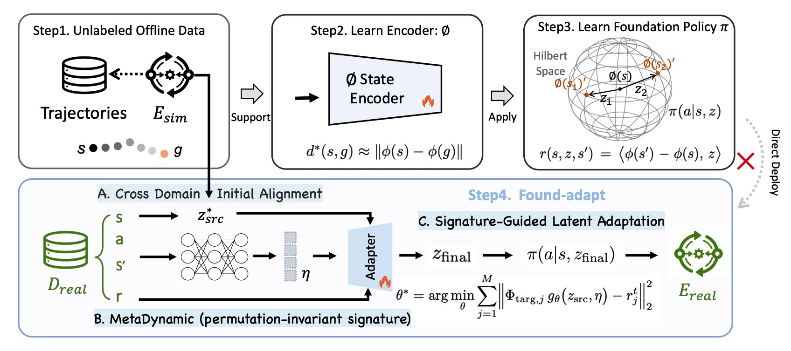

# Repository for Paper: *Latent Adaptation of Foundation Policies for Sim-to-Real Transfer*


[](https://www.python.org/downloads/)
[](https://github.com/google/jax)
[](https://mujoco.org/)
[](LICENSE)
<!-- [](https://iclr.cc/) -->


<p align="center">
  
</p>

<p align="center">
  <em>
  Figure 2: Overview of the proposed method. Offline trajectories from the simulator E_sim train a state encoder φ and a latent-conditioned policy π(a|s, z) using intrinsic rewards. Direct deployment degrades under dynamic gaps. We therefore perform latent adaptation with a small batch of target-domain data D_tar: (i) a weighted joint least-squares fit yields an initial latent z*_src; (ii) a Meta-Dynamic network extracts permutation-invariant distributional features η; (iii) an adapter network refines z*_src into z_final. The refined latent conditions π for robust execution in the target environment E_tar without retraining the policy.
  </em>
</p>

This repository contains the official experimental code used to reproduce the results reported in the paper, including:

* InDomain baseline evaluation
* Sim-to-Real adaptation experiments
* Gravity and friction variation studies
* Direct vs. Ours (test-time adaptation) comparison

The provided scripts support controlled environment perturbations and evaluation under consistent replay buffer configurations, enabling full replication of the experimental tables reported in the paper.


## 0. The sim-to-real task configurations

---

The task configurations are located in:

```
hilp_zsrl/url_benchmark/custom_dmc_tasks
```


## 1. Get the InDomain baseline performance

To obtain the **InDomain** performance, run the following command:

```bash
python hilp_zsrl/url_benchmark/test_multi_surface_offline_bothfrictionandGarvity0.py --seed 88 --mode Direct --config config_g0
```

The results reported in the experiment table are computed from **three random seeds**:


All InDomain baseline results use **Direct** mode.

**Config definition.** `config_g0` corresponds to:

```python
"config_g0": ((0, 0,  -9.81), (1.0, 0.1, 0.1)),  # first is（gravity）second is（friction）
```


### InDomain Baseline Results (Direct Mode)

| Seed           | Stands             | Walks              | Runs              | Flip              |
| -------------- | ------------------ | ------------------ | ----------------- | ----------------- |
| first              | 894.83             | 783.60             | 413.64            | 546.41            |
| second             | 901.86             | 775.76             | 413.04            | 538.83            |
| third             | 866.13             | 735.63             | 428.42            | 532.56            |
| **Mean ± Std** | **887.61 ± 18.93** | **764.99 ± 25.73** | **418.37 ± 8.71** | **539.27 ± 6.93** |


---

## 2. Reproduce Direct-Transfer Results under Gravity Variations (G1–G4)

To reproduce the Direct-Transfer results reported in Table (Gravity settings G1–G4), we identify the closest matching seeds (among 0–199) to the reported Direct-Transfer mean performance.

The selected seeds are:

| Setting | Seed |
|----------|------|
| G1 | 72 |
| G2 | 169 |
| G3 | 181 |
| G4 | 91 |

Each command below runs **only the corresponding gravity configuration** (not all configs).

---

### ✅ Reproduce G1

```bash
python hilp_zsrl/url_benchmark/test_multi_surface_offline_bothfrictionandGarvity0.py \
  --seed 72 \
  --mode Direct \
  --config config_g1
```

### ✅ Reproduce G2

```bash
python hilp_zsrl/url_benchmark/test_multi_surface_offline_bothfrictionandGarvity0.py \
  --seed 169 \
  --mode Direct \
  --config config_g2
```


### ✅ Reproduce G3
```bash
python hilp_zsrl/url_benchmark/test_multi_surface_offline_bothfrictionandGarvity0.py \
  --seed 181 \
  --mode Direct \
  --config config_g3
```

### ✅ Reproduce G4
```bash
python hilp_zsrl/url_benchmark/test_multi_surface_offline_bothfrictionandGarvity0.py \
  --seed 91 \
  --mode Direct \
  --config config_g4
```


**Config definition.** :

```python
"config_g1": ((0, 0, -15), (1.0, 0.1, 0.1)),
"config_g2": ((0, 0, -24), (1.0, 0.1, 0.1)),
"config_g3": ((0, 0, -34), (1.0, 0.1, 0.1)),
"config_g4": ((0, 0, -44), (1.0, 0.1, 0.1)),
```


## 3. Reproduce Results under Gravity Variations (G1–G4)

The weighted least-squares coefficient in this experiment is:

```
lambda_wls = 6.1
```

The selected seeds are the same as those used for the Direct-Transfer comparison:

| Setting | Seed |
| ------- | ---- |
| G1      | 72   |
| G2      | 169  |
| G3      | 181  |
| G4      | 91   |

Each command below runs only the corresponding gravity configuration using `--mode Ours` and `--lambda_wls_set 6.1`.

---

### ✅ Reproduce G1 (λ = 6.1)

```bash
python hilp_zsrl/url_benchmark/test_multi_surface_offline_bothfrictionandGarvity0.py \
  --seed 72 \
  --mode Ours \
  --config config_g1 \
  --lambda_wls_set 6.1
```

---

### ✅ Reproduce G2 (λ = 6.1)

```bash
python hilp_zsrl/url_benchmark/test_multi_surface_offline_bothfrictionandGarvity0.py \
  --seed 169 \
  --mode Ours \
  --config config_g2 \
  --lambda_wls_set 6.1
```

---

### ✅ Reproduce G3 (λ = 6.1)

```bash
python hilp_zsrl/url_benchmark/test_multi_surface_offline_bothfrictionandGarvity0.py \
  --seed 181 \
  --mode Ours \
  --config config_g3 \
  --lambda_wls_set 6.1
```

---

### ✅ Reproduce G4 (λ = 6.1)

```bash
python hilp_zsrl/url_benchmark/test_multi_surface_offline_bothfrictionandGarvity0.py \
  --seed 91 \
  --mode Ours \
  --config config_g4 \
  --lambda_wls_set 6.1
```


Ideally, you should get similar results on `Stand` Task: 


| Setting | Found-adapt Performance |
|----------|-------------------|
| G1       | 562.72            |
| G2       | 231.75            |
| G3       | 322.06            |
| G4       | 71.70             |


Please note that, the performance on other tasks would need tunning on target domain prompts.  


## Cite our work:

---

If you find this work useful, please cite:

```bibtex
@inproceedings{
da2026latent,
title={Latent Adaptation of Foundation Policies for Sim-to-Real Transfer},
author={Longchao Da and T Pranav Kutralingam and Lirong Xiang and Hua Wei},
booktitle={The Fourteenth International Conference on Learning Representations},
year={2026},
url={https://openreview.net/forum?id=yn9dzttHvT}
}
```

