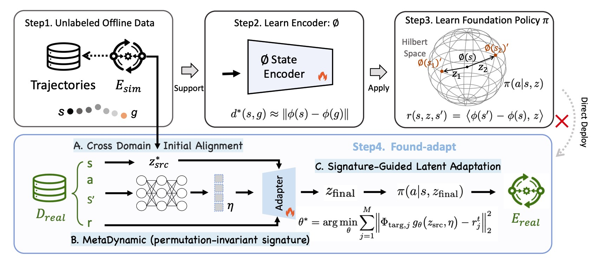

# Repository for Paper: *Latent Adaptation of Foundation Policies for Sim-to-Real Transfer*


[](https://www.python.org/downloads/)
[](https://github.com/google/jax)
[](https://mujoco.org/)
[](LICENSE)
<!-- [](https://iclr.cc/) -->


<p align="center">
  
</p>

<p align="center">
  <em>
  Figure 2: Overview of the proposed method. Offline trajectories from the simulator E_sim train a state encoder φ and a latent-conditioned policy π(a|s, z) using intrinsic rewards. Direct deployment degrades under dynamic gaps. We therefore perform latent adaptation with a small batch of target-domain data D_tar: (i) a weighted joint least-squares fit yields an initial latent z*_src; (ii) a Meta-Dynamic network extracts permutation-invariant distributional features η; (iii) an adapter network refines z*_src into z_final. The refined latent conditions π for robust execution in the target environment E_tar without retraining the policy.
  </em>
</p>

This repository contains the official experimental code used to reproduce the results reported in the paper, including:

* InDomain baseline evaluation
* Sim-to-Real adaptation experiments
* Gravity and friction variation studies
* Direct vs. Ours (test-time adaptation) comparison

The provided scripts support controlled environment perturbations and evaluation under consistent replay buffer configurations, enabling full replication of the experimental tables reported in the paper.

## Environment Setup

This codebase is tested with **Python 3.8.19**.

## Tested Hardware / Compatibility

This repository was tested on:

* **GPU:** NVIDIA **GeForce RTX 4090** (PCI device ID `10de:2684`)
* **CUDA toolkit:** **12.5** (`nvcc 12.5.40`)
* **Python:** **3.8.19**

At the moment, **RTX 5090 is not a supported/tested configuration for this repository**. We observed CUDA/driver compatibility issues on RTX 5090-class setups, so the experiments and commands in this repo should be assumed to be validated only on the RTX 4090 setup listed above unless a future update states otherwise.

```bash
git clone https://github.com/LongchaoDa/Found_adapt.git
cd Found_adapt
```

We recommend creating a fresh Conda environment and then installing the Python packages with `pip`:

```bash
conda create -n fond_zsrl python=3.8.19 -y
conda activate fond_zsrl
python -m pip install --upgrade pip
python -m pip install -r requirements.txt
```

If you prefer, you can also recreate the environment from `environment.yml`:

```bash
conda env create -f environment.yml
conda activate fond_zsrl
```

## Prerequisite Data

The data required for this repository is available here:

[Google Drive dataset link](https://drive.google.com/file/d/1DAlkur3OR8ODxfxKoZy3TXCmk451d2AR/view?usp=sharing)

Please download this data before running the experiments below.

After downloading the dataset:

1. Create a folder named `data` under `Found_adapt`.
2. Unzip the downloaded `.zip` file into `data`.
3. Make sure the extracted directory hierarchy matches:

E.g., On Linux, you can do:

```bash
cd /path/to/Found_adapt
mkdir -p data
unzip /path/to/your_downloaded_dataset.zip -d data
```

If `unzip` is not installed:

```bash
sudo apt-get update
sudo apt-get install -y unzip
```

Then verify the extracted structure:

```bash
Found_adapt/data/datacollection
```

For example, after extraction you should have paths such as:

```bash
Found_adapt/data/datacollection/Sim2RealFoundationPolicy
Found_adapt/data/datacollection/exorl_learn
Found_adapt/data/datacollection/url_verify_solved
```


## 0. The sim-to-real task configurations

---

The task configurations are located in:

```
hilp_zsrl/url_benchmark/custom_dmc_tasks
```


## 1. Get the InDomain baseline performance

To obtain the **InDomain** performance, run the following command **from the repo root**:

```bash
python hilp_zsrl/url_benchmark/test_multi_surface_offline_bothfrictionandGarvity0.py --mode Direct --config config_g0
```

Notes:
* Do **not** run this from `data/`. The script expects paths relative to the repo root.
* The dataset path defaults to `data/datacollection_mini` under the repo root. If that directory is not present, the code falls back to `data/datacollection`.
  To override, set `SIM2REAL_DATA_ROOT`:

```bash
SIM2REAL_DATA_ROOT=/absolute/path/to/datacollection_mini \
python hilp_zsrl/url_benchmark/test_multi_surface_offline_bothfrictionandGarvity0.py --mode Direct --config config_g0
```

The results reported in the experiment table are computed from **three random seeds**:


All InDomain baseline results use **Direct** mode.

**Config definition.** `config_g0` corresponds to:

```python
"config_g0": ((0, 0,  -9.81), (1.0, 0.1, 0.1)),  # first is（gravity）second is（friction）
```


### InDomain Baseline Results (Direct Mode)

| Summary (4 runs) | Stands             | Walks              | Runs              | Flip              |
| ---------------- | ------------------ | ------------------ | ----------------- | ----------------- |
| **Mean ± Std**   | **887.75 ± 13.39** | **789.85 ± 46.73** | **414.92 ± 8.58** | **542.34 ± 7.23** |


---

## 2. Reproduce Direct-Transfer Results under Gravity Variations (G1–G4)

### Paper-Reported Results (Direct-Transfer vs Found-adapt)

| Setting | Method | Stand (mean ± std) | Avg Time Cost (s) |
| ------- | ------ | ------------------ | ----------------- |
| E_sim | Foundation Policy | 887.61 ± 18.93 | 0.73 ± 0.03 |
| G1 | Direct-Transfer | 494.24 ± 95.89 | 5.06 ± 0.05 |
| G1 | Found-adapt | 562.72 ± 41.17 | 6.22 ± 0.12 |
| G2 | Direct-Transfer | 222.49 ± 27.40 | 5.36 ± 0.11 |
| G2 | Found-adapt | 231.75 ± 34.59 | 6.11 ± 0.07 |
| G3 | Direct-Transfer | 213.15 ± 78.96 | 5.14 ± 0.10 |
| G3 | Found-adapt | 322.06 ± 35.18 | 6.08 ± 0.11 |
| G4 | Direct-Transfer | 63.81 ± 14.14 | 5.28 ± 0.09 |
| G4 | Found-adapt | 71.70 ± 11.81 | 6.12 ± 0.11 |


<!-- 
To reproduce the Direct-Transfer results reported in Table (Gravity settings G1–G4), we identify the closest matching seeds (among 0–199) to the reported Direct-Transfer mean performance.

The selected seeds are:

| Setting | Seed |
|----------|------|
| G1 | 72 |
| G2 | 169 |
| G3 | 181 |
| G4 | 91 |

Each command below runs **only the corresponding gravity configuration** (not all configs).

---

### ✅ Reproduce G1

```bash
python hilp_zsrl/url_benchmark/test_multi_surface_offline_bothfrictionandGarvity0.py \
  --mode Direct \
  --config config_g1
```

### ✅ Reproduce G2

```bash
python hilp_zsrl/url_benchmark/test_multi_surface_offline_bothfrictionandGarvity0.py \
  --mode Direct \
  --config config_g2
```


### ✅ Reproduce G3
```bash
python hilp_zsrl/url_benchmark/test_multi_surface_offline_bothfrictionandGarvity0.py \
  --mode Direct \
  --config config_g3
```

### ✅ Reproduce G4
```bash
python hilp_zsrl/url_benchmark/test_multi_surface_offline_bothfrictionandGarvity0.py \
  --mode Direct \
  --config config_g4
```
 -->


**Config definition.** :

```python
"config_g1": ((0, 0, -15), (1.0, 0.1, 0.1)),
"config_g2": ((0, 0, -24), (1.0, 0.1, 0.1)),
"config_g3": ((0, 0, -34), (1.0, 0.1, 0.1)),
"config_g4": ((0, 0, -44), (1.0, 0.1, 0.1)),
```


## 3. Reproduce Results under Gravity Variations (G1–G4)

The weighted least-squares coefficient in this experiment is:

```
lambda_wls = 6.1
```

The selected seeds are the same as those used for the Direct-Transfer comparison:

| Setting | Seed |
| ------- | ---- |
| G1      | 72   |
| G2      | 169  |
| G3      | 181  |
| G4      | 91   |

Each command below runs only the corresponding gravity configuration using `--mode Ours` and `--lambda_wls_set 6.1`.

---

### ✅ Reproduce G1 (λ = 6.1)

```bash
python hilp_zsrl/url_benchmark/test_multi_surface_offline_bothfrictionandGarvity0.py \
  --mode Ours \
  --config config_g1 \
  --lambda_wls_set 6.1
```

---

### ✅ Reproduce G2 (λ = 6.1)

```bash
python hilp_zsrl/url_benchmark/test_multi_surface_offline_bothfrictionandGarvity0.py \
  --mode Ours \
  --config config_g2 \
  --lambda_wls_set 6.1
```

---

### ✅ Reproduce G3 (λ = 6.1)

```bash
python hilp_zsrl/url_benchmark/test_multi_surface_offline_bothfrictionandGarvity0.py \
  --mode Ours \
  --config config_g3 \
  --lambda_wls_set 6.1
```

---

### ✅ Reproduce G4 (λ = 6.1)

```bash
python hilp_zsrl/url_benchmark/test_multi_surface_offline_bothfrictionandGarvity0.py \
  --mode Ours \
  --config config_g4 \
  --lambda_wls_set 6.1
```

Ideally, you should get similar results on `Stand` Task: 


| Setting | Found-adapt Performance |
|----------|-------------------|
| G1       | 562.72            |
| G2       | 231.75            |
| G3       | 322.06            |
| G4       | 71.70             |


Please note that, the performance on other tasks would need tunning on target domain prompts.  


## Cite our work:

---

If you find this work useful, please cite:

```bibtex
@inproceedings{
da2026latent,
title={Latent Adaptation of Foundation Policies for Sim-to-Real Transfer},
author={Longchao Da and T Pranav Kutralingam and Lirong Xiang and Hua Wei},
booktitle={The Fourteenth International Conference on Learning Representations},
year={2026},
url={https://openreview.net/forum?id=yn9dzttHvT}
}
```
